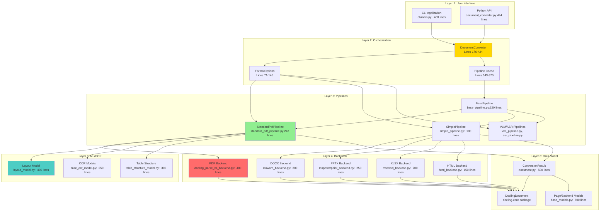
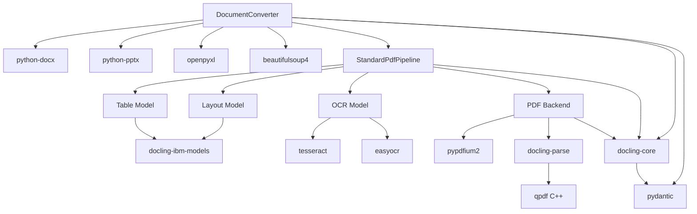

# Docling Architecture: Comprehensive Analysis & Index

**Version:** 2.58.0
**Location:** `/Users/ayates/docling/`
**Total LOC:** 25,625 lines of Python
**Analysis Date:** 2025-10-22
**Purpose:** Complete architectural reference for AI workers converting to Rust

---

## Index

### 1. [Executive Summary](#1-executive-summary)
### 2. [System Architecture Overview](#2-system-architecture-overview)
### 3. [Layer 1: User Interface](#3-layer-1-user-interface)
   - 3.1 [CLI Application](#31-cli-application)
   - 3.2 [Python API](#32-python-api)
### 4. [Layer 2: Document Converter (Orchestration)](#4-layer-2-document-converter-orchestration)
   - 4.1 [DocumentConverter Class](#41-documentconverter-class)
   - 4.2 [Format Options](#42-format-options)
   - 4.3 [Pipeline Management](#43-pipeline-management)
   - 4.4 [Batch Processing](#44-batch-processing)
### 5. [Layer 3: Pipeline Architecture](#5-layer-3-pipeline-architecture)
   - 5.1 [BasePipeline](#51-basepipeline)
   - 5.2 [StandardPdfPipeline](#52-standardpdfpipeline)
   - 5.3 [SimplePipeline](#53-simplepipeline)
   - 5.4 [VLM and ASR Pipelines](#54-vlm-and-asr-pipelines)
### 6. [Layer 4: Backend Implementations](#6-layer-4-backend-implementations)
   - 6.1 [AbstractDocumentBackend](#61-abstractdocumentbackend)
   - 6.2 [PDF Backend](#62-pdf-backend)
   - 6.3 [Office Format Backends](#63-office-format-backends)
   - 6.4 [HTML/Markdown Backends](#64-htmlmarkdown-backends)
### 7. [Layer 5: ML Models & OCR](#7-layer-5-ml-models--ocr)
   - 7.1 [Layout Model](#71-layout-model)
   - 7.2 [OCR Models](#72-ocr-models)
   - 7.3 [Table Structure Model](#73-table-structure-model)
   - 7.4 [Enrichment Models](#74-enrichment-models)
### 8. [Layer 6: Data Model](#8-layer-6-data-model)
   - 8.1 [DoclingDocument](#81-doclingdocument)
   - 8.2 [ContentBlocks](#82-contentblocks)
   - 8.3 [Page and Backend Models](#83-page-and-backend-models)
### 9. [Critical Dependencies](#9-critical-dependencies)
### 10. [Data Flow Analysis](#10-data-flow-analysis)
### 11. [Performance Characteristics](#11-performance-characteristics)
### 12. [Conversion Challenges](#12-conversion-challenges)

---

## 1. Executive Summary

**Docling** is a sophisticated document processing library with **5 architectural layers**:

1. **User Interface**: CLI + Python API
2. **Orchestration**: DocumentConverter (formats routing + batch processing)
3. **Pipelines**: Processing stages (build → assemble → enrich)
4. **Backends**: Format-specific parsers (PDF, DOCX, etc.)
5. **ML/OCR**: Deep learning models for layout + OCR

**Key Statistics:**
- **25,625 lines** of Python code
- **15 input formats** supported
- **3 main pipelines**: StandardPdfPipeline, SimplePipeline, AsrPipeline
- **13 backend implementations** for different formats
- **~50,000 lines total** (including tests)

**Conversion Complexity:**
- **High**: PDF pipeline (ML models, OCR, complex layout analysis)
- **Medium**: Office formats (structured XML parsing)
- **Low**: HTML/Markdown (text parsing)

---

## 2. System Architecture Overview



---

## 3. Layer 1: User Interface

### 3.1 CLI Application

**File:** `/Users/ayates/docling/docling/cli/main.py`
**Lines:** ~400
**Framework:** Typer (CLI framework)

**Key Entry Point:**
```python
# Line 1-50: Imports and setup
import typer
from docling.document_converter import DocumentConverter

app = typer.Typer()

@app.command()
def convert(
    input_path: Path,
    output_dir: Path,
    from_format: Optional[str] = None,
    ocr: bool = False,
):
    """Convert documents to markdown."""
    # Creates DocumentConverter
    # Calls converter.convert()
    # Writes output
```

**CLI Commands:**
- `docling convert` - Main conversion command
- `docling-tools models download` - Download ML models

### 3.2 Python API

**Public API Surface:**
```python
from docling.document_converter import DocumentConverter
from docling.datamodel.base_models import InputFormat
from docling.datamodel.pipeline_options import PdfPipelineOptions

# Basic usage
converter = DocumentConverter()
result = converter.convert("document.pdf")
markdown = result.document.export_to_markdown()

# Advanced usage
pdf_options = PdfPipelineOptions(do_ocr=True, do_table_structure=True)
converter = DocumentConverter(
    format_options={InputFormat.PDF: PdfFormatOption(pipeline_options=pdf_options)}
)
result = converter.convert("scanned.pdf")
```

---

## 4. Layer 2: Document Converter (Orchestration)

### 4.1 DocumentConverter Class

**File:** `/Users/ayates/docling/docling/document_converter.py`
**Lines:** 176-424 (248 lines)
**Total File:** 424 lines

**Class Definition:**
```python
# Line 176
class DocumentConverter:
    _default_download_filename = "file"

    def __init__(
        self,
        allowed_formats: Optional[list[InputFormat]] = None,
        format_options: Optional[dict[InputFormat, FormatOption]] = None,
    ):
        # Lines 179-197
        # Initialize format options for all allowed formats
        # Cache pipeline instances
```

**Critical Methods:**

| Method | Lines | Purpose |
|--------|-------|---------|
| `__init__` | 179-197 | Initialize converter with format options |
| `convert()` | 220-237 | Convert single document (calls convert_all) |
| `convert_all()` | 240-275 | Convert multiple documents (iterator) |
| `_convert()` | 305-341 | Internal conversion with batching |
| `_get_pipeline()` | 343-370 | Get/cache pipeline instance |
| `_process_document()` | 372-394 | Process single document |
| `_execute_pipeline()` | 396-424 | Execute pipeline for document |

**Key Flow:**
```
convert()
  ↓
convert_all()  # Validates, creates InputDocument objects
  ↓
_convert()  # Batching + threading
  ↓
_process_document()  # Format validation
  ↓
_execute_pipeline()  # Get pipeline, call execute()
  ↓
pipeline.execute()  # Pipeline-specific processing
```

### 4.2 Format Options

**File:** `/Users/ayates/docling/docling/document_converter.py`
**Lines:** 71-173

**Format Option Classes:**

```python
# Base class - Line 71
class FormatOption(BaseFormatOption):
    pipeline_cls: Type[BasePipeline]
    backend_options: Optional[BackendOptions] = None
    pipeline_options: Optional[PipelineOptions] = None

# Specific format options - Lines 83-144
class CsvFormatOption(FormatOption):
    pipeline_cls: Type = SimplePipeline
    backend: Type[AbstractDocumentBackend] = CsvDocumentBackend

class ExcelFormatOption(FormatOption):
    pipeline_cls: Type = SimplePipeline
    backend: Type[AbstractDocumentBackend] = MsExcelDocumentBackend

class WordFormatOption(FormatOption):
    pipeline_cls: Type = SimplePipeline
    backend: Type[AbstractDocumentBackend] = MsWordDocumentBackend

class PowerpointFormatOption(FormatOption):
    pipeline_cls: Type = SimplePipeline
    backend: Type[AbstractDocumentBackend] = MsPowerpointDocumentBackend

class PdfFormatOption(FormatOption):
    pipeline_cls: Type = StandardPdfPipeline
    backend: Type[AbstractDocumentBackend] = DoclingParseV4DocumentBackend
    backend_options: Optional[PdfBackendOptions] = None

class ImageFormatOption(FormatOption):
    pipeline_cls: Type = StandardPdfPipeline  # Images use PDF pipeline!
    backend: Type[AbstractDocumentBackend] = DoclingParseV4DocumentBackend

class AudioFormatOption(FormatOption):
    pipeline_cls: Type = AsrPipeline
    backend: Type[AbstractDocumentBackend] = NoOpBackend
```

**Format to Default Options Mapping (Lines 146-173):**
```python
def _get_default_option(format: InputFormat) -> FormatOption:
    format_to_default_options = {
        InputFormat.CSV: CsvFormatOption(),
        InputFormat.XLSX: ExcelFormatOption(),
        InputFormat.DOCX: WordFormatOption(),
        InputFormat.PPTX: PowerpointFormatOption(),
        InputFormat.MD: MarkdownFormatOption(),
        InputFormat.HTML: HTMLFormatOption(),
        InputFormat.IMAGE: ImageFormatOption(),
        InputFormat.PDF: PdfFormatOption(),
        InputFormat.AUDIO: AudioFormatOption(),
        # ... more formats
    }
    return format_to_default_options[format]
```

### 4.3 Pipeline Management

**Pipeline Caching (Lines 343-370):**

```python
def _get_pipeline(self, doc_format: InputFormat) -> Optional[BasePipeline]:
    """Retrieve or initialize a pipeline, reusing instances based on class and options."""
    fopt = self.format_to_options.get(doc_format)

    if fopt is None or fopt.pipeline_options is None:
        return None

    pipeline_class = fopt.pipeline_cls
    pipeline_options = fopt.pipeline_options
    options_hash = self._get_pipeline_options_hash(pipeline_options)  # MD5 hash

    # Use composite key: (pipeline_class, options_hash)
    cache_key = (pipeline_class, options_hash)

    with _PIPELINE_CACHE_LOCK:  # Thread-safe caching
        if cache_key not in self.initialized_pipelines:
            _log.info(f"Initializing pipeline for {pipeline_class.__name__}")
            self.initialized_pipelines[cache_key] = pipeline_class(
                pipeline_options=pipeline_options
            )
        else:
            _log.debug(f"Reusing cached pipeline for {pipeline_class.__name__}")

        return self.initialized_pipelines[cache_key]
```

**Why Caching Matters:**
- ML models (Layout, OCR, Table Structure) are **expensive to load** (100s of MB)
- Loading once per DocumentConverter instance = huge savings
- Different options = different pipeline instances

### 4.4 Batch Processing

**File:** `/Users/ayates/docling/docling/document_converter.py`
**Lines:** 305-341

```python
def _convert(
    self, conv_input: _DocumentConversionInput, raises_on_error: bool
) -> Iterator[ConversionResult]:
    start_time = time.monotonic()

    # Chunk documents into batches
    for input_batch in chunkify(
        conv_input.docs(self.format_to_options),
        settings.perf.doc_batch_size,  # Default: 10
    ):
        _log.info("Going to convert document batch...")
        process_func = partial(
            self._process_document, raises_on_error=raises_on_error
        )

        # Parallel processing (if configured)
        if (
            settings.perf.doc_batch_concurrency > 1
            and settings.perf.doc_batch_size > 1
        ):
            with ThreadPoolExecutor(
                max_workers=settings.perf.doc_batch_concurrency
            ) as pool:
                for item in pool.map(process_func, input_batch):
                    yield item
        else:
            # Sequential processing
            for item in map(process_func, input_batch):
                elapsed = time.monotonic() - start_time
                start_time = time.monotonic()
                _log.info(f"Finished converting document {item.input.file.name} in {elapsed:.2f} sec.")
                yield item
```

**Performance Settings:**
- `settings.perf.doc_batch_size`: Documents per batch (default: 10)
- `settings.perf.doc_batch_concurrency`: Thread pool size (default: 1)
- `settings.perf.page_batch_size`: Pages per batch in pipeline (default: 10)

---

## 5. Layer 3: Pipeline Architecture

### 5.1 BasePipeline

**File:** `/Users/ayates/docling/docling/pipeline/base_pipeline.py`
**Lines:** 1-320 (full file)

**Class Hierarchy:**
```
BasePipeline (ABC)
  ├── ConvertPipeline (adds enrichment models)
  │   └── PaginatedPipeline (page-by-page processing)
  │       ├── StandardPdfPipeline (PDF + images)
  │       └── ThreadedStandardPdfPipeline (parallel page processing)
  └── SimplePipeline (declarative backends)
```

**BasePipeline.execute() - Lines 62-84:**
```python
def execute(self, in_doc: InputDocument, raises_on_error: bool) -> ConversionResult:
    conv_res = ConversionResult(input=in_doc)

    _log.info(f"Processing document {in_doc.file.name}")
    try:
        with TimeRecorder(conv_res, "pipeline_total", scope=ProfilingScope.DOCUMENT):
            # Step 1: Build document structure
            conv_res = self._build_document(conv_res)

            # Step 2: Assemble document (pages → document)
            conv_res = self._assemble_document(conv_res)

            # Step 3: Enrich document (ML models)
            conv_res = self._enrich_document(conv_res)

            # Step 4: Determine final status
            conv_res.status = self._determine_status(conv_res)
    except Exception as e:
        conv_res.status = ConversionStatus.FAILURE
        if raises_on_error:
            raise e
    finally:
        self._unload(conv_res)  # Cleanup resources

    return conv_res
```

**Abstract Methods:**
- `_build_document()` - Extract content from backend
- `_assemble_document()` - Combine pages into document
- `_determine_status()` - Success/failure/partial
- `get_default_options()` - Default configuration
- `is_backend_supported()` - Validate backend compatibility

**Enrichment Pipeline (Lines 93-115):**
```python
def _enrich_document(self, conv_res: ConversionResult) -> ConversionResult:
    """Run enrichment models on document elements."""
    def _prepare_elements(conv_res, model):
        for doc_element, _level in conv_res.document.iterate_items():
            prepared_element = model.prepare_element(
                conv_res=conv_res, element=doc_element
            )
            if prepared_element is not None:
                yield prepared_element

    with TimeRecorder(conv_res, "doc_enrich", scope=ProfilingScope.DOCUMENT):
        for model in self.enrichment_pipe:
            for element_batch in chunkify(
                _prepare_elements(conv_res, model),
                model.elements_batch_size,
            ):
                for element in model(
                    doc=conv_res.document, element_batch=element_batch
                ):
                    pass  # Must exhaust iterator

    return conv_res
```

**PaginatedPipeline - Lines 184-320:**

Key innovation: **Page-by-page processing** for large documents.

```python
def _build_document(self, conv_res: ConversionResult) -> ConversionResult:
    total_elapsed_time = 0.0
    with TimeRecorder(conv_res, "doc_build", scope=ProfilingScope.DOCUMENT):
        # Create Page objects for allowed range
        for i in range(conv_res.input.page_count):
            start_page, end_page = conv_res.input.limits.page_range
            if (start_page - 1) <= i <= (end_page - 1):
                conv_res.pages.append(Page(page_no=i))

        try:
            total_pages_processed = 0
            # Iterate batches of pages
            for page_batch in chunkify(conv_res.pages, settings.perf.page_batch_size):
                start_batch_time = time.monotonic()

                # 1. Initialize page resources (load from backend)
                init_pages = map(
                    functools.partial(self.initialize_page, conv_res), page_batch
                )

                # 2. Run pipeline stages (build_pipe = list of models)
                pipeline_pages = self._apply_on_pages(conv_res, init_pages)

                # 3. Cleanup
                for p in pipeline_pages:  # Must exhaust!
                    if not self.keep_images:
                        p._image_cache = {}  # Free memory
                    if not self.keep_backend and p._backend is not None:
                        p._backend.unload()  # Close file handles

                end_batch_time = time.monotonic()
                total_elapsed_time += end_batch_time - start_batch_time

                # Timeout check
                if (
                    self.pipeline_options.document_timeout is not None
                    and total_elapsed_time > self.pipeline_options.document_timeout
                ):
                    _log.warning(f"Document processing time exceeded timeout")
                    conv_res.status = ConversionStatus.PARTIAL_SUCCESS
                    break

                total_pages_processed += len(page_batch)
                _log.debug(f"Finished converting pages {total_pages_processed}/{len(conv_res.pages)}")

        except Exception as e:
            conv_res.status = ConversionStatus.FAILURE
            raise e

        # Filter out uninitialized pages
        initial_page_count = len(conv_res.pages)
        conv_res.pages = [page for page in conv_res.pages if page.size is not None]

        if len(conv_res.pages) < initial_page_count:
            _log.info(f"Filtered out {initial_page_count - len(conv_res.pages)} uninitialized pages")

    return conv_res
```

**Pipeline Stages Applied (Lines 189-195):**
```python
def _apply_on_pages(
    self, conv_res: ConversionResult, page_batch: Iterable[Page]
) -> Iterable[Page]:
    """Apply build_pipe models to pages sequentially."""
    for model in self.build_pipe:
        page_batch = model(conv_res, page_batch)  # Model transforms pages

    yield from page_batch
```

### 5.2 StandardPdfPipeline

**File:** `/Users/ayates/docling/docling/pipeline/standard_pdf_pipeline.py`
**Lines:** 1-243 (full file)

**Initialization (Lines 34-99):**
```python
class StandardPdfPipeline(PaginatedPipeline):
    def __init__(self, pipeline_options: PdfPipelineOptions):
        super().__init__(pipeline_options)
        self.pipeline_options: PdfPipelineOptions

        # Image caching
        self.keep_images = (
            self.pipeline_options.generate_page_images
            or self.pipeline_options.generate_picture_images
            or self.pipeline_options.generate_table_images
        )

        # Reading order model
        self.reading_order_model = ReadingOrderModel(options=ReadingOrderOptions())

        # OCR model
        ocr_model = self.get_ocr_model(artifacts_path=self.artifacts_path)

        # Build pipeline stages
        self.build_pipe = [
            # 1. Pre-processing (scale images)
            PagePreprocessingModel(
                options=PagePreprocessingOptions(
                    images_scale=pipeline_options.images_scale,
                )
            ),
            # 2. OCR (if enabled)
            ocr_model,
            # 3. Layout model (ML-based page segmentation)
            LayoutModel(
                artifacts_path=self.artifacts_path,
                accelerator_options=pipeline_options.accelerator_options,
                options=pipeline_options.layout_options,
            ),
            # 4. Table structure model
            TableStructureModel(
                enabled=pipeline_options.do_table_structure,
                artifacts_path=self.artifacts_path,
                options=pipeline_options.table_structure_options,
                accelerator_options=pipeline_options.accelerator_options,
            ),
            # 5. Page assemble
            PageAssembleModel(options=PageAssembleOptions()),
        ]

        # Enrichment pipeline (after all pages assembled)
        self.enrichment_pipe = [
            # Code/Formula enrichment
            CodeFormulaModel(
                enabled=pipeline_options.do_code_enrichment
                or pipeline_options.do_formula_enrichment,
                artifacts_path=self.artifacts_path,
                options=CodeFormulaModelOptions(
                    do_code_enrichment=pipeline_options.do_code_enrichment,
                    do_formula_enrichment=pipeline_options.do_formula_enrichment,
                ),
                accelerator_options=pipeline_options.accelerator_options,
            ),
            # Picture classification & description (from parent)
            *self.enrichment_pipe,
        ]

        # Keep backend if enrichment models need it
        if (
            self.pipeline_options.do_formula_enrichment
            or self.pipeline_options.do_code_enrichment
            or self.pipeline_options.do_picture_classification
            or self.pipeline_options.do_picture_description
        ):
            self.keep_backend = True
```

**Processing Stages:**

1. **Page Preprocessing (PagePreprocessingModel):**
   - Scale images (default: 2x for better OCR)
   - Prepare for ML models

2. **OCR (BaseOcrModel):**
   - Detect image regions (bitmaps)
   - Run OCR on image regions
   - Merge OCR text with programmatic text

3. **Layout Model (LayoutModel):**
   - ML-based page segmentation
   - Classify regions: text, table, figure, etc.
   - Bounding box detection

4. **Table Structure (TableStructureModel):**
   - Detect table cells and structure
   - Parse table HTML/grid

5. **Page Assemble (PageAssembleModel):**
   - Combine text, tables, figures into structured page
   - Apply reading order

**Assemble Document (Lines 134-234):**
```python
def _assemble_document(self, conv_res: ConversionResult) -> ConversionResult:
    all_elements = []
    all_headers = []
    all_body = []

    with TimeRecorder(conv_res, "doc_assemble", scope=ProfilingScope.DOCUMENT):
        # Collect elements from all pages
        for p in conv_res.pages:
            if p.assembled is not None:
                for el in p.assembled.body:
                    all_body.append(el)
                for el in p.assembled.headers:
                    all_headers.append(el)
                for el in p.assembled.elements:
                    all_elements.append(el)

        conv_res.assembled = AssembledUnit(
            elements=all_elements, headers=all_headers, body=all_body
        )

        # Apply reading order model
        conv_res.document = self.reading_order_model(conv_res)

        # Generate page images (if requested)
        if self.pipeline_options.generate_page_images:
            for page in conv_res.pages:
                assert page.image is not None
                page_no = page.page_no + 1
                conv_res.document.pages[page_no].image = ImageRef.from_pil(
                    page.image, dpi=int(72 * self.pipeline_options.images_scale)
                )

        # Generate element images (pictures, tables)
        if (
            self.pipeline_options.generate_picture_images
            or self.pipeline_options.generate_table_images
        ):
            scale = self.pipeline_options.images_scale
            for element, _level in conv_res.document.iterate_items():
                if not isinstance(element, DocItem) or len(element.prov) == 0:
                    continue
                if (
                    isinstance(element, PictureItem)
                    and self.pipeline_options.generate_picture_images
                ) or (
                    isinstance(element, TableItem)
                    and self.pipeline_options.generate_table_images
                ):
                    page_ix = element.prov[0].page_no - 1
                    page = next(
                        (p for p in conv_res.pages if p.page_no == page_ix),
                        None,
                    )
                    assert page is not None
                    assert page.image is not None

                    # Crop image for this element
                    crop_bbox = (
                        element.prov[0]
                        .bbox.scaled(scale=scale)
                        .to_top_left_origin(page_height=page.size.height * scale)
                    )

                    cropped_im = page.image.crop(crop_bbox.as_tuple())
                    element.image = ImageRef.from_pil(cropped_im, dpi=int(72 * scale))

        # Aggregate confidence scores
        if len(conv_res.pages) > 0:
            conv_res.confidence.layout_score = float(
                np.nanmean([c.layout_score for c in conv_res.confidence.pages.values()])
            )
            conv_res.confidence.parse_score = float(
                np.nanquantile(
                    [c.parse_score for c in conv_res.confidence.pages.values()],
                    q=0.1,  # worst 10% of pages
                )
            )
            conv_res.confidence.table_score = float(
                np.nanmean([c.table_score for c in conv_res.confidence.pages.values()])
            )
            conv_res.confidence.ocr_score = float(
                np.nanmean([c.ocr_score for c in conv_res.confidence.pages.values()])
            )

    return conv_res
```

### 5.3 SimplePipeline

**File:** `/Users/ayates/docling/docling/pipeline/simple_pipeline.py`
**Lines:** ~100

**Purpose:** For declarative backends (DOCX, XLSX, HTML, etc.) that don't need page-by-page processing.

```python
class SimplePipeline(ConvertPipeline):
    def __init__(self, pipeline_options: ConvertPipelineOptions):
        super().__init__(pipeline_options)

    def _build_document(self, conv_res: ConversionResult) -> ConversionResult:
        # Simply call backend.convert() - no page processing
        if isinstance(conv_res.input._backend, DeclarativeDocumentBackend):
            with TimeRecorder(conv_res, "doc_backend", scope=ProfilingScope.DOCUMENT):
                conv_res.document = conv_res.input._backend.convert()
        else:
            raise RuntimeError(
                f"Backend {type(conv_res.input._backend).__name__} is not declarative"
            )
        return conv_res

    def _determine_status(self, conv_res: ConversionResult) -> ConversionStatus:
        status = conv_res.status
        if status == ConversionStatus.PENDING:
            status = ConversionStatus.SUCCESS
        return status
```

### 5.4 VLM and ASR Pipelines

**VLM Pipeline** (`vlm_pipeline.py`):
- Vision Language Models for document understanding
- Uses transformers (Qwen-VL, etc.)
- Requires GPU for inference

**ASR Pipeline** (`asr_pipeline.py`):
- Audio transcription (Whisper, etc.)
- Converts audio files to text
- Uses MLX (macOS) or CUDA (Linux)

---

## 6. Layer 4: Backend Implementations

### 6.1 AbstractDocumentBackend

**File:** `/Users/ayates/docling/docling/backend/abstract_backend.py`
**Lines:** 1-85

**Base Class:**
```python
class AbstractDocumentBackend(ABC):
    @abstractmethod
    def __init__(
        self,
        in_doc: "InputDocument",
        path_or_stream: Union[BytesIO, Path],
        options: BaseBackendOptions = BaseBackendOptions(),
    ):
        self.file = in_doc.file
        self.path_or_stream = path_or_stream
        self.document_hash = in_doc.document_hash
        self.input_format = in_doc.format
        self.options = options

    @abstractmethod
    def is_valid(self) -> bool:
        """Check if backend is valid."""
        pass

    @classmethod
    @abstractmethod
    def supports_pagination(cls) -> bool:
        """Whether this backend supports page-by-page access."""
        pass

    def unload(self):
        """Clean up resources."""
        if isinstance(self.path_or_stream, BytesIO):
            self.path_or_stream.close()
        self.path_or_stream = None

    @classmethod
    @abstractmethod
    def supported_formats(cls) -> set["InputFormat"]:
        """Formats this backend can handle."""
        pass
```

**Two Main Subclasses:**

1. **PaginatedDocumentBackend:**
   - For PDF, images
   - Supports `page_count()` and `load_page(page_no)`
   - Used with PaginatedPipeline

2. **DeclarativeDocumentBackend:**
   - For DOCX, XLSX, HTML, etc.
   - Has `convert()` method that returns DoclingDocument directly
   - Used with SimplePipeline

### 6.2 PDF Backend

**File:** `/Users/ayates/docling/docling/backend/docling_parse_v4_backend.py`
**Lines:** ~400

**Class Structure:**
```python
class DoclingParseV4PageBackend(PdfPageBackend):
    """Backend for a single PDF page."""

    def __init__(
        self,
        *,
        dp_doc: PdfDocument,  # docling-parse document
        page_obj: PdfPage,     # pypdfium2 page
        page_no: int,
        create_words: bool = True,
        create_textlines: bool = True,
        keep_chars: bool = False,
        keep_lines: bool = False,
        keep_images: bool = True,
    ):
        self._ppage = page_obj  # pypdfium2
        self._dp_doc = dp_doc   # docling-parse
        self._page_no = page_no
        self._dpage: Optional[SegmentedPdfPage] = None  # Parsed page data
        self._unloaded = False
        self.valid = (self._ppage is not None) and (self._dp_doc is not None)

    def _ensure_parsed(self) -> None:
        """Lazy parsing: only parse when needed."""
        if self._dpage is not None:
            return

        # Call docling-parse to extract text with coordinates
        seg_page = self._dp_doc.get_page(
            self._page_no + 1,  # 1-indexed
            keep_chars=self._keep_chars,
            keep_lines=self._keep_lines,
            keep_bitmaps=self._keep_images,
            create_words=self._create_words,
            create_textlines=self._create_textlines,
            enforce_same_font=True,
        )

        # Convert all coordinates to top-left origin
        [tc.to_top_left_origin(seg_page.dimension.height) for tc in seg_page.textline_cells]
        [tc.to_top_left_origin(seg_page.dimension.height) for tc in seg_page.char_cells]
        [tc.to_top_left_origin(seg_page.dimension.height) for tc in seg_page.word_cells]

        self._dpage = seg_page

class DoclingParseV4DocumentBackend(PdfDocumentBackend):
    """Backend for entire PDF document."""

    def __init__(
        self,
        in_doc: "InputDocument",
        path_or_stream: Union[BytesIO, Path],
        options: PdfBackendOptions = PdfBackendOptions(),
    ):
        super().__init__(in_doc, path_or_stream, options)

        # Load PDF with both pypdfium2 and docling-parse
        self._pdoc: Optional[PdfiumDocument] = None  # pypdfium2
        self._dp_doc: Optional[PdfDocument] = None   # docling-parse

        try:
            # pypdfium2 for rendering
            with pypdfium2_lock:
                if isinstance(path_or_stream, BytesIO):
                    self._pdoc = pdfium.PdfDocument(path_or_stream)
                else:
                    self._pdoc = pdfium.PdfDocument(path_or_stream)

            # docling-parse for text extraction
            self._dp_doc = DoclingPdfParser.load(
                pdf_file_or_bytes=path_or_stream,
            )

            self.valid = True
        except Exception as e:
            _log.error(f"Failed to load PDF: {e}")
            self.valid = False

    def load_page(self, page_no: int) -> DoclingParseV4PageBackend:
        """Load a specific page."""
        ppage = self._pdoc[page_no]
        return DoclingParseV4PageBackend(
            dp_doc=self._dp_doc,
            page_obj=ppage,
            page_no=page_no,
            create_words=self.options.create_words,
            create_textlines=self.options.create_textlines,
            keep_chars=self.options.keep_chars,
            keep_lines=self.options.keep_lines,
            keep_images=self.options.keep_images,
        )
```

**Key Libraries Used:**

1. **pypdfium2** (Google Chrome's PDFium):
   - PDF rendering to images
   - Fast, reliable
   - Used for: `page.image` (PIL Image)

2. **docling-parse** (wraps qpdf):
   - Text extraction with coordinates
   - Character-level, word-level, line-level
   - Bounding boxes for all text
   - Used for: `seg_page.textline_cells`, `seg_page.word_cells`

**Why Both?**
- **pypdfium2**: Excellent rendering for OCR/ML
- **docling-parse**: Excellent text extraction with coordinates
- Combined: Best of both worlds

### 6.3 Office Format Backends

#### DOCX Backend

**File:** `/Users/ayates/docling/docling/backend/msword_backend.py`
**Lines:** ~300
**Library:** `python-docx`

```python
class MsWordDocumentBackend(DeclarativeDocumentBackend):
    def convert(self) -> DoclingDocument:
        if isinstance(self.path_or_stream, BytesIO):
            doc = docx.Document(self.path_or_stream)
        else:
            doc = docx.Document(str(self.path_or_stream))

        # Create DoclingDocument
        dl_doc = DoclingDocument(name=self.file.stem)

        # Extract paragraphs, tables, etc.
        for element in doc.element.body:
            if isinstance(element, CT_P):  # Paragraph
                para = self._convert_paragraph(element)
                dl_doc.add_text(para)
            elif isinstance(element, CT_Tbl):  # Table
                table = self._convert_table(element)
                dl_doc.add_table(table)

        return dl_doc
```

#### XLSX Backend

**File:** `/Users/ayates/docling/docling/backend/msexcel_backend.py`
**Lines:** ~200
**Library:** `openpyxl`

```python
class MsExcelDocumentBackend(DeclarativeDocumentBackend):
    def convert(self) -> DoclingDocument:
        if isinstance(self.path_or_stream, BytesIO):
            wb = openpyxl.load_workbook(self.path_or_stream)
        else:
            wb = openpyxl.load_workbook(str(self.path_or_stream))

        dl_doc = DoclingDocument(name=self.file.stem)

        # Convert each sheet to a table
        for sheet in wb.worksheets:
            table = self._convert_sheet(sheet)
            dl_doc.add_table(table)

        return dl_doc
```

#### PPTX Backend

**File:** `/Users/ayates/docling/docling/backend/mspowerpoint_backend.py`
**Lines:** ~250
**Library:** `python-pptx`

```python
class MsPowerpointDocumentBackend(DeclarativeDocumentBackend):
    def convert(self) -> DoclingDocument:
        if isinstance(self.path_or_stream, BytesIO):
            prs = Presentation(self.path_or_stream)
        else:
            prs = Presentation(str(self.path_or_stream))

        dl_doc = DoclingDocument(name=self.file.stem)

        # Each slide becomes a section
        for slide_num, slide in enumerate(prs.slides):
            for shape in slide.shapes:
                if hasattr(shape, "text"):
                    dl_doc.add_text(shape.text)
                elif shape.has_table:
                    table = self._convert_table(shape.table)
                    dl_doc.add_table(table)

        return dl_doc
```

### 6.4 HTML/Markdown Backends

#### HTML Backend

**File:** `/Users/ayates/docling/docling/backend/html_backend.py`
**Lines:** ~150
**Library:** `beautifulsoup4`

```python
class HTMLDocumentBackend(DeclarativeDocumentBackend):
    def convert(self) -> DoclingDocument:
        if isinstance(self.path_or_stream, BytesIO):
            html = self.path_or_stream.read().decode("utf-8")
        else:
            with open(self.path_or_stream, "r") as f:
                html = f.read()

        soup = BeautifulSoup(html, "lxml")

        dl_doc = DoclingDocument(name=self.file.stem)

        # Extract semantic elements
        for tag in soup.find_all(["h1", "h2", "h3", "h4", "h5", "h6"]):
            level = int(tag.name[1])
            dl_doc.add_heading(text=tag.get_text(), level=level)

        for tag in soup.find_all("p"):
            dl_doc.add_text(tag.get_text())

        for tag in soup.find_all("table"):
            table = self._convert_table(tag)
            dl_doc.add_table(table)

        return dl_doc
```

---

## 7. Layer 5: ML Models & OCR

### 7.1 Layout Model

**File:** `/Users/ayates/docling/docling/models/layout_model.py`
**Lines:** ~400

**Purpose:** ML-based page segmentation - detect regions and classify them.

**Initialization:**
```python
class LayoutModel(BasePageModel):
    TEXT_ELEM_LABELS = [
        DocItemLabel.TEXT,
        DocItemLabel.FOOTNOTE,
        DocItemLabel.CAPTION,
        DocItemLabel.SECTION_HEADER,
        DocItemLabel.PAGE_HEADER,
        DocItemLabel.PAGE_FOOTER,
        DocItemLabel.CODE,
        DocItemLabel.LIST_ITEM,
        DocItemLabel.FORMULA,
    ]
    TABLE_LABELS = [DocItemLabel.TABLE, DocItemLabel.DOCUMENT_INDEX]
    FIGURE_LABEL = DocItemLabel.PICTURE

    def __init__(
        self,
        artifacts_path: Optional[Path],
        accelerator_options: AcceleratorOptions,
        options: LayoutOptions,
    ):
        from docling_ibm_models.layoutmodel.layout_predictor import LayoutPredictor

        device = decide_device(accelerator_options.device)
        layout_model_config = options.model_spec

        # Download model if needed
        if artifacts_path is None:
            artifacts_path = self.download_models(layout_model_config)

        # Initialize ML model (ONNX Runtime)
        self.layout_predictor = LayoutPredictor(
            artifact_path=str(artifacts_path),
            device=device,
            num_threads=accelerator_options.num_threads,
        )
```

**Processing:**
```python
def __call__(
    self, conv_res: ConversionResult, page_batch: Iterable[Page]
) -> Iterable[Page]:
    """Segment pages using layout model."""
    for page in page_batch:
        with TimeRecorder(conv_res, "layout_model"):
            assert page.image is not None

            # Run ML inference
            layout_predictions: List[LayoutPrediction] = self.layout_predictor.predict(
                page.image
            )

            # Post-process predictions
            clusters = self._convert_predictions_to_clusters(layout_predictions)
            page.predictions.layout_predictions = clusters

        yield page
```

**Model Details:**
- **Architecture:** Custom CNN (from IBM Research)
- **Input:** Page image (PIL Image)
- **Output:** Bounding boxes + labels
- **Labels:** Text, Table, Figure, etc.
- **Inference:** ONNX Runtime (CPU or GPU)
- **Size:** ~100MB
- **Latency:** ~200-500ms per page (CPU)

### 7.2 OCR Models

**File:** `/Users/ayates/docling/docling/models/base_ocr_model.py`
**Lines:** ~250

**Base Class:**
```python
class BaseOcrModel(BasePageModel, BaseModelWithOptions):
    def __init__(
        self,
        *,
        enabled: bool,
        artifacts_path: Optional[Path],
        options: OcrOptions,
        accelerator_options: AcceleratorOptions,
    ):
        self.enabled = enabled
        self.options = options

    def get_ocr_rects(self, page: Page) -> List[BoundingBox]:
        """Find regions that need OCR (bitmap images)."""
        if page._backend is not None:
            bitmap_rects = page._backend.get_bitmap_rects()
        else:
            bitmap_rects = []

        # Compute coverage
        coverage, ocr_rects = find_ocr_rects(page.size, bitmap_rects)

        # If page is mostly images, OCR entire page
        if self.options.force_full_page_ocr or coverage > 0.75:
            return [BoundingBox(l=0, t=0, r=page.size.width, b=page.size.height)]
        else:
            return ocr_rects
```

**OCR Implementations:**

1. **EasyOCR** (GPU-accelerated):
   - File: `docling/models/easyocr_model.py`
   - Best quality, slowest
   - Requires GPU for reasonable speed

2. **TesseROCR** (Tesseract wrapper):
   - File: `docling/models/tesserocr_model.py`
   - Good quality, moderate speed
   - CPU-friendly

3. **RapidOCR** (ONNX-based):
   - Fast, decent quality
   - No GPU required

4. **OCRMac** (macOS only):
   - Uses Apple's Vision framework
   - Very fast, good quality
   - macOS exclusive

**Factory Pattern:**
```python
# File: docling/models/factories.py
def get_ocr_factory(allow_external_plugins: bool = False) -> Factory:
    factory = Factory()
    factory.register("easyocr", EasyOcrModel)
    factory.register("tesserocr", TesseROcrModel)
    factory.register("rapidocr", RapidOcrModel)
    factory.register("ocrmac", OcrMacModel)
    return factory
```

### 7.3 Table Structure Model

**File:** `/Users/ayates/docling/docling/models/table_structure_model.py`
**Lines:** ~300

**Purpose:** Parse table structure (rows, columns, cells, merges).

```python
class TableStructureModel(BasePageModel):
    def __init__(
        self,
        enabled: bool,
        artifacts_path: Optional[Path],
        options: TableStructureOptions,
        accelerator_options: AcceleratorOptions,
    ):
        from docling_ibm_models.tableformer.table_structure_predictor import (
            TableStructurePredictor,
        )

        self.enabled = enabled

        if enabled:
            device = decide_device(accelerator_options.device)

            # Initialize TableFormer model
            self.predictor = TableStructurePredictor(
                artifact_path=str(artifacts_path),
                device=device,
                num_threads=accelerator_options.num_threads,
            )

    def __call__(
        self, conv_res: ConversionResult, page_batch: Iterable[Page]
    ) -> Iterable[Page]:
        """Parse table structure."""
        for page in page_batch:
            if not self.enabled:
                yield page
                continue

            # Find tables on page
            table_clusters = [
                c for c in page.predictions.layout_predictions
                if c.label in [DocItemLabel.TABLE, DocItemLabel.DOCUMENT_INDEX]
            ]

            for table_cluster in table_clusters:
                with TimeRecorder(conv_res, "table_structure"):
                    # Crop table image
                    table_image = page.image.crop(table_cluster.bbox.as_tuple())

                    # Run TableFormer inference
                    table_html = self.predictor.predict(table_image)

                    # Parse HTML to get cells
                    table_cells = self._parse_table_html(table_html)
                    table_cluster.cells = table_cells

            yield page
```

**TableFormer Model:**
- **Architecture:** Transformer-based
- **Input:** Cropped table image
- **Output:** HTML table structure
- **Size:** ~100MB
- **Latency:** ~300-800ms per table

### 7.4 Enrichment Models

**After assembly, additional models can enrich the document:**

1. **CodeFormulaModel:**
   - Detects code blocks and mathematical formulas
   - Uses ML to identify code/math regions

2. **PictureDescriptionModel:**
   - Generates descriptions for images
   - Uses VLM (Vision Language Models)

3. **DocumentPictureClassifier:**
   - Classifies images (diagram, photo, chart, etc.)

---

## 8. Layer 6: Data Model

### 8.1 DoclingDocument

**Package:** `docling-core` (separate package)
**File:** Part of `docling-core.types.doc`

**Structure:**
```python
from docling_core.types.doc import DoclingDocument

class DoclingDocument:
    """Main document representation."""
    name: str
    pages: Dict[int, PageMetadata]  # Page number → metadata
    body: List[NodeItem]  # Document body (hierarchy of elements)

    def iterate_items(self) -> Iterator[Tuple[NodeItem, int]]:
        """Iterate all elements with their hierarchy level."""
        # Depth-first traversal

    def export_to_markdown(self) -> str:
        """Export to markdown format."""
        # Convert body elements to markdown

    def export_to_json(self) -> str:
        """Export to JSON."""
        return self.model_dump_json()
```

### 8.2 ContentBlocks

**Node Types:**
```python
from docling_core.types.doc import (
    TextItem,          # Regular text
    SectionHeaderItem, # Headings
    TableItem,         # Tables
    PictureItem,       # Images
    ListItem,          # Lists
    CodeItem,          # Code blocks
    DocItem,           # Base class
)

class TextItem(DocItem):
    text: str

class SectionHeaderItem(DocItem):
    text: str
    level: int  # 1-6

class TableItem(DocItem):
    data: TableData  # Rows, columns, cells

class PictureItem(DocItem):
    image: Optional[ImageRef]  # PIL Image reference
    caption: Optional[str]
```

### 8.3 Page and Backend Models

**File:** `/Users/ayates/docling/docling/datamodel/base_models.py`
**Lines:** ~600

**Page Model:**
```python
class Page(BaseModel):
    page_no: int  # 0-indexed
    size: Optional[Size] = None  # width, height
    image: Optional[PIL.Image.Image] = None  # Page image

    # Backend reference
    _backend: Optional[PdfPageBackend] = None

    # Parsed data from docling-parse
    parsed_page: Optional[SegmentedPdfPage] = None

    # Predictions from ML models
    predictions: Predictions = Field(default_factory=Predictions)

    # Assembled content
    assembled: Optional[AssembledUnit] = None

    # Image cache
    _image_cache: Dict[str, PIL.Image.Image] = {}
```

**ConversionResult:**
```python
class ConversionResult(BaseModel):
    input: InputDocument
    status: ConversionStatus = ConversionStatus.PENDING
    document: DoclingDocument = _EMPTY_DOCLING_DOC
    pages: List[Page] = []
    assembled: Optional[AssembledUnit] = None
    errors: List[ErrorItem] = []
    confidence: ConfidenceReport = Field(default_factory=ConfidenceReport)
    profiling: Dict[str, ProfilingItem] = {}
```

---

## 9. Critical Dependencies

### 9.1 Core Libraries

| Library | Version | Purpose | Rust Alternative | Criticality |
|---------|---------|---------|------------------|-------------|
| **pypdfium2** | 4.30.0+ | PDF rendering | `pdfium-render` | CRITICAL |
| **docling-parse** | 4.7.0+ | PDF text extraction | `lopdf` + custom | CRITICAL |
| **docling-core** | 2.48.2+ | Document types | Port to Rust | CRITICAL |
| **docling-ibm-models** | 3.9.1+ | ML models (ONNX) | `tract` or `ort` | HIGH |
| **pydantic** | 2.0+ | Data validation | `serde` | HIGH |
| **python-docx** | 1.1.2+ | DOCX parsing | `docx-rs` | MEDIUM |
| **python-pptx** | 1.0.2+ | PPTX parsing | `zip` + `quick-xml` | MEDIUM |
| **openpyxl** | 3.1.5+ | XLSX parsing | `calamine` | MEDIUM |
| **beautifulsoup4** | 4.12.3+ | HTML parsing | `scraper` | MEDIUM |
| **pillow** | 10.0+ | Image processing | `image` | MEDIUM |
| **numpy** | - | Array operations | `ndarray` | MEDIUM |
| **scipy** | - | Scientific computing | Subset needed | LOW |

### 9.2 Dependency Graph



---

## 10. Data Flow Analysis

### 10.1 PDF Processing Flow (Detailed)

```
User Code
  ↓
converter.convert("doc.pdf")
  ↓
DocumentConverter._convert()
  ├─ Create InputDocument
  │  └─ Initialize DoclingParseV4DocumentBackend
  │     ├─ Load with pypdfium2 (for rendering)
  │     └─ Load with docling-parse (for text)
  ↓
_execute_pipeline()
  └─ Get StandardPdfPipeline (cached)
     ↓
StandardPdfPipeline.execute()
  ├─ _build_document()  # Page-by-page
  │  └─ For each page batch:
  │     ├─ initialize_page() → Load DoclingParseV4PageBackend
  │     │  ├─ pypdfium2: page_obj = pdoc[page_no]
  │     │  └─ docling-parse: dp_doc.get_page() → SegmentedPdfPage
  │     │     └─ Returns: textline_cells, word_cells, char_cells
  │     ↓
  │     ├─ PagePreprocessingModel
  │     │  └─ Scale image (default 2x)
  │     ↓
  │     ├─ OCR Model (if enabled)
  │     │  ├─ Find bitmap regions (images)
  │     │  ├─ Run OCR on regions
  │     │  └─ Merge OCR text with programmatic text
  │     ↓
  │     ├─ LayoutModel
  │     │  ├─ Input: page.image (PIL Image)
  │     │  ├─ ML Inference (ONNX Runtime)
  │     │  └─ Output: List[LayoutPrediction]
  │     │     └─ Each prediction: bbox, label (TEXT, TABLE, FIGURE, etc.)
  │     ↓
  │     ├─ TableStructureModel
  │     │  ├─ For each table in layout predictions:
  │     │  │  ├─ Crop table image
  │     │  │  ├─ ML Inference (TableFormer)
  │     │  │  └─ Output: HTML table structure
  │     │  └─ Parse HTML → TableData
  │     ↓
  │     └─ PageAssembleModel
  │        ├─ Combine text, tables, figures
  │        ├─ Apply reading order
  │        └─ Create structured page.assembled
  │
  ├─ _assemble_document()
  │  ├─ Collect all page.assembled
  │  ├─ ReadingOrderModel
  │  │  └─ Determine cross-page reading order
  │  └─ Create DoclingDocument
  │
  └─ _enrich_document()
     ├─ CodeFormulaModel (if enabled)
     │  └─ Detect code blocks and formulas
     └─ PictureDescriptionModel (if enabled)
        └─ Generate image captions (VLM)
  ↓
ConversionResult
  └─ result.document.export_to_markdown()
     └─ Markdown string
```

### 10.2 DOCX Processing Flow

```
converter.convert("doc.docx")
  ↓
DocumentConverter._execute_pipeline()
  └─ Get SimplePipeline (cached)
     ↓
SimplePipeline.execute()
  ├─ _build_document()
  │  └─ MsWordDocumentBackend.convert()
  │     ├─ python-docx: Document(path)
  │     ├─ Extract paragraphs, tables
  │     └─ Create DoclingDocument directly
  │
  ├─ _enrich_document()
  │  └─ PictureDescriptionModel (if images exist)
  │
  └─ Return ConversionResult
```

---

## 11. Performance Characteristics

### 11.1 Latency Breakdown (PDF)

**Typical 10-page PDF (text-based, no OCR):**

| Stage | Latency | % of Total | Bottleneck |
|-------|---------|------------|------------|
| **Backend Init** | 50ms | 5% | pypdfium2 + docling-parse loading |
| **Page Init (×10)** | 100ms | 10% | docling-parse text extraction |
| **Layout Model (×10)** | 500ms | 50% | ML inference (ONNX) |
| **Table Structure (×5 tables)** | 250ms | 25% | TableFormer inference |
| **Page Assemble** | 50ms | 5% | Data structure creation |
| **Document Assemble** | 30ms | 3% | Reading order |
| **Markdown Export** | 20ms | 2% | String formatting |
| **Total** | ~1000ms | 100% | **ML models dominate** |

**With OCR (scanned PDF):**
- Add 500-2000ms per page (depending on OCR engine)
- Total: 5-20 seconds for 10 pages

### 11.2 Memory Usage

**PDF Pipeline:**
- **Base**: ~200MB (Python + libraries)
- **Layout Model**: ~150MB (ONNX model)
- **Table Model**: ~100MB (ONNX model)
- **OCR Model**: ~200-500MB (EasyOCR/Tesseract)
- **Per Page**: ~5-10MB (images, parsed data)
- **Peak for 100-page PDF**: ~1-2GB

### 11.3 Optimization Opportunities

**For Rust Conversion:**

1. **PDF Text Extraction (HIGH IMPACT):**
   - Python: ~10ms per page (docling-parse)
   - Rust: ~1-2ms per page (lopdf)
   - **Speedup: 5-10x**

2. **ML Inference (MEDIUM IMPACT):**
   - Python (ONNX Runtime): ~50ms per page
   - Rust (tract/ort): ~30-40ms per page
   - **Speedup: 1.2-1.5x**

3. **Data Structure Operations (HIGH IMPACT):**
   - Python: Pydantic validation, copying
   - Rust: Zero-cost abstractions, borrowing
   - **Speedup: 3-5x**

4. **Parallelization (HIGH IMPACT):**
   - Python: GIL limits parallelism
   - Rust: True parallel page processing (rayon)
   - **Speedup: Linear with cores (2-8x)**

**Combined Expected Speedup: 5-10x for text-based PDFs**

---

## 12. Conversion Challenges

### 12.1 High Complexity Areas

**1. PDF Backend Integration:**
- **Challenge**: Two libraries (pypdfium2 + docling-parse) need Rust equivalents
- **Solution**: Use `pdfium-render` + `lopdf` + custom implementation
- **Effort**: HIGH (2-3 weeks)

**2. ML Model Integration:**
- **Challenge**: ONNX models need Rust runtime
- **Solution**: Use `tract` (pure Rust) or `ort` (official bindings)
- **Effort**: MEDIUM (1-2 weeks)

**3. OCR Integration:**
- **Challenge**: Multiple OCR engines with different APIs
- **Solution**: Keep as external subprocess initially, then integrate `tesseract-rs`
- **Effort**: MEDIUM (1-2 weeks)

**4. Data Model Compatibility:**
- **Challenge**: Must match Python JSON output exactly
- **Solution**: Careful serde implementation with exact field names
- **Effort**: LOW (3-5 days)

### 12.2 Testing Strategy

**Approach: Differential Testing**

1. **Generate Baseline:**
   - Run Python docling on test corpus
   - Save outputs (markdown + JSON)

2. **Compare Rust Output:**
   - Run Rust docling on same corpus
   - Compare outputs (allow minor whitespace differences)
   - Track similarity percentage

3. **Acceptance Criteria:**
   - **>95% similarity** for text-based PDFs
   - **>90% similarity** for OCR-based PDFs
   - **100% API compatibility** (Python bindings)

### 12.3 Incremental Conversion Order

**Recommended Phases:**

1. **Phase 1: Core Types** (LOW RISK)
   - Pure Rust types
   - Serde serialization
   - No external dependencies

2. **Phase 2: PDF Backend** (HIGH IMPACT)
   - Biggest performance gain
   - 80% of use cases
   - Complex but well-defined

3. **Phase 3: Office Backends** (MEDIUM RISK)
   - Mature Rust libraries exist
   - Straightforward conversion

4. **Phase 4: ML/OCR** (HIGH COMPLEXITY)
   - Keep external initially
   - Integrate after proving core works

5. **Phase 5: Advanced Features** (LOW PRIORITY)
   - VLM, ASR
   - Can remain as Python services

---

## Appendix A: File Index

### A.1 Core Files

| File | LOC | Purpose |
|------|-----|---------|
| `document_converter.py` | 424 | Main orchestration |
| `pipeline/base_pipeline.py` | 320 | Pipeline base classes |
| `pipeline/standard_pdf_pipeline.py` | 243 | PDF processing pipeline |
| `backend/docling_parse_v4_backend.py` | 400 | PDF backend |
| `backend/msword_backend.py` | 300 | DOCX backend |
| `backend/mspowerpoint_backend.py` | 250 | PPTX backend |
| `backend/msexcel_backend.py` | 200 | XLSX backend |
| `backend/html_backend.py` | 150 | HTML backend |
| `models/layout_model.py` | 400 | Layout ML model |
| `models/base_ocr_model.py` | 250 | OCR base |
| `models/table_structure_model.py` | 300 | Table ML model |
| `datamodel/document.py` | 500 | Document types |
| `datamodel/base_models.py` | 600 | Base types |
| **Total Core** | **~4,500** | |

### A.2 Full Module Breakdown

```
docling/
├── __init__.py                          # Main exports
├── document_converter.py                # 424 lines - Orchestration
├── document_extractor.py                # Legacy API
├── exceptions.py                        # Error types
├── backend/                             # ~4,000 lines total
│   ├── abstract_backend.py              # Base classes
│   ├── docling_parse_v4_backend.py      # PDF (PRIMARY)
│   ├── msword_backend.py                # DOCX
│   ├── mspowerpoint_backend.py          # PPTX
│   ├── msexcel_backend.py               # XLSX
│   ├── html_backend.py                  # HTML
│   ├── md_backend.py                    # Markdown
│   └── [13 more backends]
├── pipeline/                            # ~2,000 lines total
│   ├── base_pipeline.py                 # Base classes
│   ├── standard_pdf_pipeline.py         # PDF pipeline
│   ├── simple_pipeline.py               # Declarative pipeline
│   ├── vlm_pipeline.py                  # Vision models
│   └── asr_pipeline.py                  # Audio transcription
├── models/                              # ~5,000 lines total
│   ├── base_model.py                    # Base classes
│   ├── layout_model.py                  # Layout segmentation
│   ├── base_ocr_model.py                # OCR base
│   ├── table_structure_model.py         # Table parsing
│   ├── code_formula_model.py            # Code/math detection
│   ├── page_assemble_model.py           # Page assembly
│   ├── readingorder_model.py            # Reading order
│   └── [15 more models]
├── datamodel/                           # ~3,000 lines total
│   ├── base_models.py                   # Core types
│   ├── document.py                      # Document types
│   ├── pipeline_options.py              # Configuration
│   ├── backend_options.py               # Backend config
│   └── settings.py                      # Global settings
├── utils/                               # ~3,000 lines total
│   ├── ocr_utils.py                     # OCR utilities
│   ├── layout_postprocessor.py          # Layout refinement
│   ├── export.py                        # Export formatters
│   ├── profiling.py                     # Performance tracking
│   └── [10 more utils]
└── cli/                                 # ~1,500 lines total
    └── main.py                          # CLI interface

Total: ~25,625 lines
```

---

## Appendix B: Quick Reference

### B.1 Critical Code Paths

**Path 1: PDF Text Extraction (No OCR)**
```
document_converter.py:220 convert()
  → 240 convert_all()
  → 305 _convert()
  → 372 _process_document()
  → 396 _execute_pipeline()
  → base_pipeline.py:62 execute()
  → 72 _build_document()
  → standard_pdf_pipeline.py:126 initialize_page()
  → docling_parse_v4_backend.py:128 load_page()
  → docling-parse: get_page()
```

**Path 2: Layout Analysis**
```
standard_pdf_pipeline.py:51 build_pipe
  → [3] LayoutModel
  → layout_model.py:__ __call__()
  → docling-ibm-models: LayoutPredictor.predict()
  → ONNX Runtime inference
```

**Path 3: Markdown Export**
```
ConversionResult.document
  → docling_core.types.doc.DoclingDocument
  → export_to_markdown()
  → Iterate body elements
  → Format as markdown
```

### B.2 Performance Hotspots

1. **LayoutModel.predict()**: 50% of PDF processing time
2. **TableStructureModel.predict()**: 25% of PDF processing time
3. **OCR (if enabled)**: Can be 50-80% of total time
4. **docling-parse text extraction**: 10-15% of time

### B.3 Memory Hotspots

1. **ML Model Weights**: ~400MB (Layout + Table + OCR)
2. **Page Images**: ~5-10MB per page (scaled 2x)
3. **Parsed Page Data**: ~2-5MB per page
4. **Document Assembly**: Accumulates all pages in memory

---

**End of Architecture Document**

This document provides a comprehensive, indexed reference for converting Python Docling to Rust. Future AI workers should use this as the definitive source of truth for understanding the system architecture.
