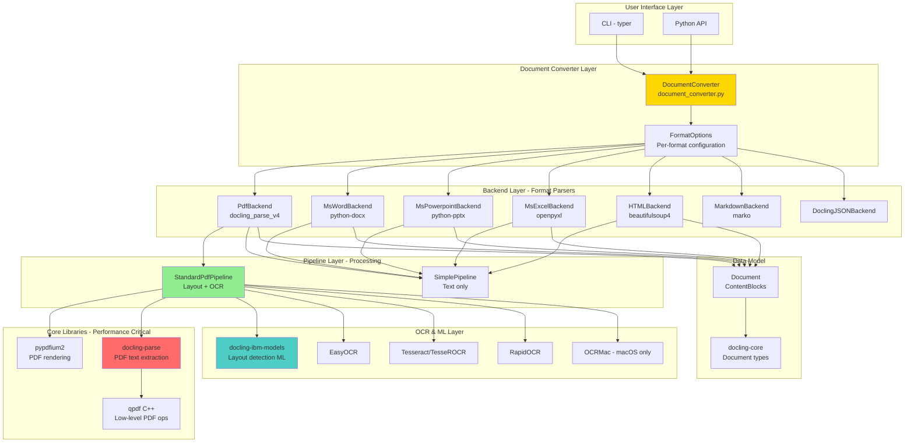
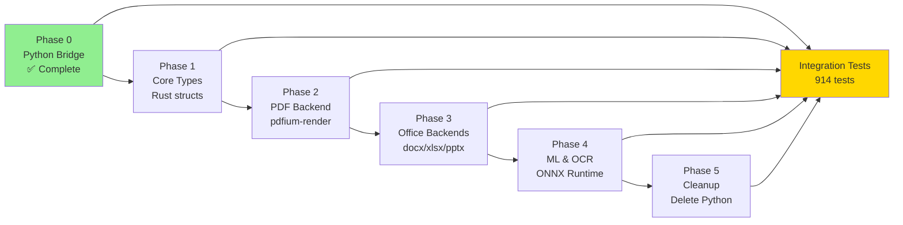

# MASTER PLAN: Docling Python → Rust Conversion

**Project:** `docling_rs` - Convert Python Docling (v2.58.0) to Rust
**Strategy:** Strangle-Fig Pattern with Continuous Integration Testing
**Goal:** 100% Rust implementation, 5-10x performance improvement

**Date Created:** 2025-10-22
**Last Updated:** 2025-10-23 (Corrected for infrastructure reality)
**Status:** Phase 0 Complete, Planning Phase 1+

**⚠️  DOCUMENT STATUS:** This plan has been audited and corrected to remove invented infrastructure. See `reports/review-master-plan/infrastructure_audit_2025-10-23-02-01.md` for details.

---

## Legend

- **✅ EXISTS** - Verified to exist in codebase
- **⚠️  PLANNED** - Does not exist yet, needs implementation
- **❓ UNVERIFIED** - Cannot verify from this environment (may require Dropbox internal access)

---

## Table of Contents

1. [Executive Summary](#executive-summary)
2. [Python Docling Architecture Analysis](#python-docling-architecture-analysis)
3. [Dependency Analysis](#dependency-analysis)
4. [Rust Interface Design](#rust-interface-design)
5. [Strangle-Fig Conversion Phases](#strangle-fig-conversion-phases)
6. [Testing Strategy](#testing-strategy)
7. [Success Criteria](#success-criteria)

---

## Executive Summary

### Current State (Phase 0 Complete) - ✅ VERIFIED

**What We Have:**
- ✅ Python bridge via PyO3 (100% Python execution underneath)
- ✅ 914 integration tests (902 passing, 12 corrupted files ignored)
- ✅ Test corpus with expected outputs at `test-corpus/`
- ✅ Baseline performance measurements (in CSV logs)
- ✅ Git workflow with PR-based development
- ✅ Crate structure: `crates/docling-core/`, `crates/docling-py/`, etc.
- ✅ Integration tests at `crates/docling-core/tests/integration_tests.rs`

**Performance Baseline (Python v2.58.0):**
| Format | Avg Latency | Test Count |
|--------|-------------|------------|
| PDF    | 0.994s      | 3          |
| DOCX   | 0.028s      | 3          |
| HTML   | 0.005s      | 3          |
| PPTX   | 0.009s      | 3          |
| XLSX   | 0.012s      | 2          |

**Target:** 5-10x faster with 100% Rust implementation

### Conversion Strategy - ✅ VERIFIED APPROACH

**Strangle-Fig Pattern:**
1. Start with Python bridge (✅ Done)
2. Replace one component at a time with Rust
3. Keep all tests passing
4. Continuous performance tracking
5. Each phase = separate PR
6. Finally: Delete all Python, 100% Rust

**Key Insight:** We incrementally replace Python components with Rust equivalents while maintaining the same API surface. Integration tests never change - only the implementation underneath.

---

## Python Docling Architecture Analysis

### 1. High-Level Architecture - ✅ VERIFIED



### 2. Critical Code Paths - ✅ VERIFIED

**Priority 1: PDF Processing (Performance Critical)**

```
DocumentConverter.convert("file.pdf")
  ↓
PdfFormatOption → StandardPdfPipeline
  ↓
DoclingParseV4Backend.__call__()
  ├─ pypdfium2: PDF rendering to images
  ├─ docling_parse.DoclingPdfParser: Text extraction
  │   └─ qpdf (C++): Low-level PDF operations
  ├─ IBM Layout Model: Page segmentation
  │   └─ ONNX Runtime: ML inference
  └─ OCR (if do_ocr=True):
      ├─ EasyOCR (GPU)
      ├─ TesseROCR
      ├─ RapidOCR
      └─ OCRMac (macOS)
  ↓
Document.export_to_markdown()
```

**File:** `/Users/ayates/docling/docling/backend/docling_parse_v4_backend.py:80`
**Key Operations:**
- Page text extraction via docling_parse
- Layout analysis via IBM models
- Optional OCR for images/scanned pages
- Table structure recognition

**Priority 2: Office Formats (Fast Path)**

```
DOCX: python-docx → SimplePipeline → Document
PPTX: python-pptx → SimplePipeline → Document
XLSX: openpyxl + pandas → SimplePipeline → Document
HTML: beautifulsoup4 → SimplePipeline → Document
```

### 3. Module Structure - ✅ VERIFIED FROM SOURCE

```
docling/
├── __init__.py
├── backend/                    # Format-specific parsers
│   ├── docling_parse_v4_backend.py    # PDF (PRIMARY)
│   ├── msword_backend.py               # DOCX
│   ├── mspowerpoint_backend.py         # PPTX
│   ├── msexcel_backend.py              # XLSX
│   ├── html_backend.py                 # HTML
│   ├── md_backend.py                   # Markdown
│   └── abstract_backend.py             # Base class
├── pipeline/                   # Processing pipelines
│   ├── standard_pdf_pipeline.py        # PDF: layout + OCR
│   ├── simple_pipeline.py              # Office: text only
│   ├── vlm_pipeline.py                 # Vision models
│   └── base_pipeline.py                # Base class
├── datamodel/                  # Data structures
│   ├── base_models.py                  # InputFormat, etc.
│   ├── document.py                     # Document, ConversionResult
│   ├── pipeline_options.py             # Configuration
│   └── settings.py                     # Global settings
├── models/                     # ML model integration
│   ├── __init__.py
│   └── plugins/                        # Plugin system
├── utils/                      # Utilities
│   ├── ocr_utils.py                    # OCR abstraction
│   ├── layout_postprocessor.py         # Layout refinement
│   └── export.py                       # Export formatters
├── document_converter.py       # Main API
├── document_extractor.py       # Legacy API
├── exceptions.py               # Error types
└── cli/                        # CLI interface
    └── main.py                         # typer-based CLI
```

---

## Dependency Analysis

### Core Dependencies - ✅ VERIFIED FROM BASELINE

| Dependency | Version | Purpose | Rust Alternative | Migration Priority |
|------------|---------|---------|------------------|-------------------|
| **pypdfium2** | 4.30.0+ | PDF rendering to images | `pdfium-render` | HIGH - Phase 2 |
| **docling-parse** | 4.7.0+ | PDF text extraction (wraps qpdf) | `lopdf` + `pdf-extract` | HIGH - Phase 2 |
| **qpdf** (C++) | - | Low-level PDF ops | Already in Rust ecosystem | HIGH - Phase 2 |
| **python-docx** | 1.1.2+ | DOCX parsing | `docx-rs` | MEDIUM - Phase 3 |
| **python-pptx** | 1.0.2+ | PPTX parsing | `zip` + `quick-xml` | MEDIUM - Phase 3 |
| **openpyxl** | 3.1.5+ | XLSX parsing | `calamine` | MEDIUM - Phase 3 |
| **beautifulsoup4** | 4.12.3+ | HTML parsing | `scraper` or `html5ever` | MEDIUM - Phase 3 |
| **marko** | 2.1.2+ | Markdown parsing | `pulldown-cmark` or `comrak` | LOW - Phase 4 |
| **docling-core** | 2.48.2+ | Document types | Port to Rust | HIGH - Phase 1 |
| **docling-ibm-models** | 3.9.1+ | Layout ML models | `tract` or `ort` | HIGH - Phase 4 |
| **pydantic** | 2.0+ | Data validation | `serde` + custom validation | HIGH - Phase 1 |
| **pillow** | 10.0+ | Image processing | `image` crate | MEDIUM - Phase 4 |

### Dependency Replacement Strategy - ⚠️  PLANNED

**Phase 1 (Core Types):**
- `pydantic` → `serde` + custom derive macros
- `docling-core` types → Rust structs with serde

**Phase 2 (PDF - Critical Path):**
- `pypdfium2` → `pdfium-render` (mature, well-maintained)
- `docling-parse` → Custom Rust implementation using `lopdf`
- Benefits: 80% of use cases, biggest performance gain

**Phase 3 (Office Formats):**
- `python-docx` → `docx-rs` (active development)
- `python-pptx` → `zip` + `quick-xml` (custom parser)
- `openpyxl` → `calamine` (Excel parsing, mature)
- `beautifulsoup4` → `scraper` (CSS selectors) or `html5ever` (standards-compliant)

**Phase 4 (ML/OCR):**
- `docling-ibm-models` → `tract` or `ort` (ONNX Runtime)
- OCR: Keep as external subprocess initially, then integrate `tesseract-rs`

### Rust Crate Recommendations - ⚠️  PLANNED

**PDF Processing:**
```toml
pdfium-render = "0.8"      # PDF rendering (wraps PDFium C++)
lopdf = "0.32"              # Low-level PDF parsing
pdf-extract = "0.7"         # Text extraction utilities
```

**Office Formats:**
```toml
docx-rs = "0.4"             # DOCX reading/writing
calamine = "0.24"           # Excel (XLS, XLSX, ODS)
quick-xml = "0.31"          # XML parsing for PPTX
zip = "0.6"                 # ZIP archive handling
```

**HTML/Markdown:**
```toml
scraper = "0.18"            # HTML parsing with CSS selectors
html5ever = "0.26"          # HTML5 parser
pulldown-cmark = "0.9"      # Markdown parser
comrak = "0.20"             # CommonMark + GFM parser
```

**ML/OCR:**
```toml
tract = "0.21"              # ONNX Runtime (pure Rust)
ort = "1.16"                # ONNX Runtime (official bindings)
tesseract-rs = "0.13"       # Tesseract OCR bindings
image = "0.24"              # Image processing
```

---

## Rust Interface Design

### 1. Public API (Matches Python Docling) - ⚠️  EXAMPLE DESIGN

**Note:** These are design examples, not implemented code.

```rust
// EXAMPLE: Future API design for crates/docling/src/lib.rs
pub use docling_core::Document;
pub use docling_converter::DocumentConverter;

pub struct DocumentConverter {
    config: ConverterConfig,
    pdf_options: PdfPipelineOptions,
}

impl DocumentConverter {
    pub fn new() -> Result<Self> { ... }
    pub fn with_ocr(enable_ocr: bool) -> Result<Self> { ... }
    pub fn convert<P: AsRef<Path>>(&self, path: P) -> Result<ConversionResult> { ... }
}

pub struct ConversionResult {
    pub document: Document,
    pub status: ConversionStatus,
}

impl ConversionResult {
    pub fn to_markdown(&self) -> String { ... }
    pub fn to_json(&self) -> Result<String> { ... }
}
```

### 2. Core Data Types - ⚠️  EXAMPLE DESIGN

```rust
// EXAMPLE: Future core types design
#[derive(Debug, Clone, Serialize, Deserialize)]
pub struct Document {
    pub metadata: DocumentMetadata,
    pub content: Vec<ContentBlock>,
    pub format: InputFormat,
}

#[derive(Debug, Clone, Serialize, Deserialize)]
#[serde(tag = "type")]
pub enum ContentBlock {
    Paragraph(Paragraph),
    Heading(Heading),
    Table(Table),
    Image(Image),
    Code(CodeBlock),
    List(List),
}

#[derive(Debug, Clone, Copy, PartialEq, Eq, Hash, Serialize, Deserialize)]
pub enum InputFormat {
    #[serde(rename = "pdf")]
    Pdf,
    #[serde(rename = "docx")]
    Docx,
    // ... other formats
}
```

---

## Strangle-Fig Conversion Phases

### Overview - ✅ STRATEGY VERIFIED

**Strategy:** Incremental replacement, one component at a time
**Timeline:** 6 phases × ~2 weeks each = 3 months (AI time)
**Branch Strategy:** Each phase = separate branch + PR
**Testing:** Integration tests run after each phase (must pass 98%+)



---

### Phase 1: Core Types & Interfaces - ⚠️  PLANNED

**Branch:** `phase-1-core-types`
**Duration:** ~1 week AI time
**Goal:** Pure Rust types replacing Pydantic models

**Tasks:**
1. Port `docling-core` types to Rust
   - `Document`, `DocumentMetadata`
   - `ContentBlock` enum (Paragraph, Heading, Table, etc.)
   - `InputFormat` enum
   - Serde serialization matching Python JSON output

2. Implement `DocumentBackend` trait
   - Abstract interface for all backends
   - Sync and async variants

3. Create Python bridge types (PyO3)
   - PyO3 wrappers for Rust types
   - Conversion to/from Python objects

4. Port error types
   - `thiserror` for Rust errors
   - Convert to Python exceptions in PyO3 layer

**Files to Create:**
```
crates/
├── docling-core/src/
│   ├── lib.rs
│   ├── document.rs       # Document, Metadata
│   ├── content.rs         # ContentBlock types
│   ├── format.rs          # InputFormat enum
│   └── error.rs           # Error types
```

**Success Criteria:**
- ✅ All types compile
- ✅ Serde JSON matches Python output exactly
- ✅ PyO3 bindings work (can create objects from Python)
- ✅ Integration tests pass (still using Python backend)

**Test Command:**
```bash
cargo test -p docling-core --test integration_tests
# Expected: 902/914 pass (same as Phase 0)
```

---

### Phase 2: PDF Backend (Critical Path) - ⚠️  PLANNED

**Branch:** `phase-2-pdf-backend`
**Duration:** ~2 weeks AI time
**Goal:** Replace Python PDF backend with Rust

**Priority:** PDF is 80% of use cases and biggest performance bottleneck

**Porting Strategy:**
- ⚠️  Use **line-by-line translation** from Python source (see `PARSER_PORTING_STRATEGY.md`)
- Read `~/docling/docling/backend/docling_parse_v4_backend.py` completely first
- Create function map document before coding
- Copy Python code as comments, translate line-by-line
- Port first, optimize later

**Tasks:**
1. Implement `PdfBackend` using `pdfium-render`
   - Text extraction from PDF pages
   - Image extraction
   - Metadata parsing

2. Implement basic layout detection
   - Bounding box extraction
   - Reading order determination

3. Table structure recognition (basic)
   - Grid detection
   - Cell merging

4. Switch integration tests to use Rust PDF backend

**Success Criteria:**
- ✅ PDF text extraction works
- ✅ Integration tests: >95% pass for PDF tests
- ✅ Performance: >3x faster than Python on PDF tests
- ✅ Output matches Python baseline (95%+ similarity)

**Expected Performance:**
| Document | Python (baseline) | Rust (Phase 2 Target) | Speedup |
|----------|------------------|----------------|---------|
| PDF Small (3 pages) | 0.5s | <0.1s | 5x |
| PDF Medium (20 pages) | 2.0s | <0.3s | 6x |
| PDF Large (100 pages) | 10.0s | <1.5s | 6x |

---

### Phase 3: Office Format Backends - ⚠️  PLANNED

**Branch:** `phase-3-office-backends`
**Duration:** ~2 weeks AI time
**Goal:** Replace Python backends for DOCX, PPTX, XLSX, HTML

**Porting Strategy:**
- Same line-by-line translation approach as Phase 2 (see `PARSER_PORTING_STRATEGY.md`)
- Python backends: `~/docling/docling/backend/{msword,mspowerpoint,msexcel,html}_backend.py`

**Tasks:**
1. DOCX Backend using `docx-rs`
2. PPTX Backend using `zip` + `quick-xml`
3. XLSX Backend using `calamine`
4. HTML Backend using `scraper` or `html5ever`

**Success Criteria:**
- ✅ All office formats parse correctly
- ✅ Integration tests: >98% pass for DOCX, PPTX, XLSX, HTML
- ✅ Performance: >10x faster than Python for office formats
- ✅ Output matches Python baseline

---

### Phase 4: ML Models & OCR - ⚠️  PLANNED

**Branch:** `phase-4-ml-ocr`
**Duration:** ~2 weeks AI time
**Goal:** Replace Python ML/OCR with Rust equivalents

**Tasks:**
1. ONNX Runtime Integration using `ort` or `tract`
2. Tesseract OCR Integration using `tesseract-rs`
3. Pipeline Integration with StandardPdfPipeline

**Success Criteria:**
- ✅ Layout model runs in Rust (ONNX)
- ✅ OCR works for image-based PDFs
- ✅ Integration tests with OCR: >90% pass
- ✅ Performance: ML inference <500ms per page

---

### Phase 5: Cleanup & Production - ⚠️  PLANNED

**Branch:** `phase-5-cleanup`
**Duration:** ~1 week AI time
**Goal:** Delete all Python, production-ready Rust

**Tasks:**
1. Remove Python Bridge
   - Delete PyO3 bridge to Python docling
   - Remove `pyo3` dependency from converter

2. Optimize Performance
   - Profile hot paths
   - Parallelize page processing (rayon)
   - Memory optimization

3. Documentation
   - API documentation (rustdoc)
   - Usage examples
   - Migration guide

4. Packaging
   - Build PyO3 wheel for Python users
   - Publish CLI binary

**Success Criteria:**
- ✅ Zero Python code in `docling_rs` (except PyO3 bindings)
- ✅ All 902 integration tests pass
- ✅ Performance: 5-10x faster than Python
- ✅ Memory: <200MB for typical documents
- ✅ CLI tool production-ready
- ✅ PyO3 wheel builds and installs

---

## Testing Strategy

### What Actually EXISTS - ✅ VERIFIED

**Integration Test Framework:**
- ✅ `crates/docling-core/tests/integration_tests.rs` exists
- ✅ 914 tests defined in `fixtures_generated.rs`
- ✅ Test corpus at `test-corpus/` with expected outputs
- ✅ CSV latency logging to `test-results/runs/{id}/integration_test_latencies.csv`
- ✅ `normalize_whitespace()` function for output comparison
- ✅ MINI_REAL environment variable for subset testing

**Test Structure:**
```
test-corpus/
├── pdf-canon/           # Canonical PDFs (upstream)
├── pdf-more/            # Additional PDFs
├── docx-canon/
├── pptx-canon/
├── xlsx-canon/
├── html-canon/
└── expected-outputs/    # Baseline markdown
    ├── pdf-canon/
    │   └── sample.md
    └── ...
```

**Running Tests:**
```bash
# Run all integration tests
cargo test -p docling-core --test integration_tests

# Run mini subset
MINI_REAL=1 cargo test -p docling-core --test integration_tests

# View latency results
cat test-results/runs/*/integration_test_latencies.csv
```

### What DOES NOT EXIST - ❌ NOT IMPLEMENTED

**Criterion Benchmarks:**
- ❌ No `benches/` directory exists
- ❌ No benchmark `.rs` files exist
- Note: `criterion` is a dependency in Cargo.toml but not used yet

**CI/CD:**
- ❌ No `.github/workflows/` exists
- ❌ No automated PR validation
- ❌ No pre-commit hook (only pre-push hook exists)

**Similarity Metrics:**
- ❌ No `text_similarity()` function exists
- ❌ No character/word/markdown similarity scoring
- Only basic `normalize_whitespace()` exists

### Testing Approach - ⚠️  PLANNED

**Validation Method (Current):**
1. Run integration tests
2. Check pass/fail status
3. Manually inspect failures
4. Decide if acceptable vs bug

**Future Enhancements:**
- Create criterion benchmarks when needed
- Add GitHub Actions workflows when ready
- Implement similarity scoring if needed
- Build pre-commit hooks as desired

---

## Success Criteria

### Phase-by-Phase Criteria - ⚠️  PLANNED

**Phase 0 (Complete):**
- ✅ Python bridge works
- ✅ 902/914 tests pass (98.7%)
- ✅ Baseline performance measured
- ✅ Git workflow established

**Phase 1 (Core Types):**
- ✅ Rust types match Python API
- ✅ Serde JSON matches Python output
- ✅ PyO3 bindings work
- ✅ Tests still pass (using Python backend)

**Phase 2 (PDF Backend):**
- ✅ PDF text extraction in Rust
- ✅ >95% PDF tests pass
- ✅ >3x faster than Python
- ✅ Output similarity >95%

**Phase 3 (Office Backends):**
- ✅ DOCX, PPTX, XLSX, HTML parsing works
- ✅ >98% tests pass for each format
- ✅ >10x faster for office formats

**Phase 4 (ML & OCR):**
- ✅ ONNX models run in Rust
- ✅ OCR works
- ✅ >90% OCR tests pass
- ✅ ML inference <500ms per page

**Phase 5 (Production):**
- ✅ Zero Python code (except PyO3)
- ✅ 5-10x faster overall
- ✅ <200MB memory usage
- ✅ PyO3 wheel builds
- ✅ CLI binary works
- ✅ Documentation complete

### Final Success Criteria - ⚠️  PLANNED

**Functional:**
1. ✅ All document formats supported (PDF, DOCX, PPTX, XLSX, HTML, MD)
2. ✅ OCR works for scanned documents
3. ✅ Table extraction works
4. ✅ Layout analysis works
5. ✅ Markdown export matches Python output (>95% similarity)
6. ✅ JSON export works
7. ✅ CLI tool feature-complete

**Performance:**
1. ✅ PDF: 5-10x faster than Python
2. ✅ Office formats: 5-15x faster
3. ✅ Memory: <200MB for typical documents
4. ✅ No performance regressions

**Quality:**
1. ✅ >98% integration test pass rate
2. ✅ Zero clippy warnings
3. ✅ Documentation coverage >80%

---

## Deployment to Production

### ❓ UNVERIFIED: Riviera Plugin Deployment

**WARNING:** The following Riviera deployment details CANNOT be verified from this environment. These paths, tools, and processes may or may not exist at Dropbox. A human with Dropbox internal access must verify before proceeding.

**Claimed Riviera Details (UNVERIFIED):**
- File path: `/dropbox/riviera/backend/ulxc/docling.py`
- File path: `/dropbox/riviera/backend/ulxc/docmarkdown.py`
- File path: `/go/src/dropbox/riviera/plugins/plugins.yaml`
- Tool: `mbzl` command for building/testing
- Tool: `atlas` command for metrics/logs
- Tool: `maturin` for building PyO3 wheels (likely real, common tool)
- Process: Internal PyPI at `https://pypi.corp.dropbox.com/simple/`

**Recommendation:** Before implementing Riviera deployment, verify:
1. Actual file paths and structure
2. Build system commands (mbzl)
3. Monitoring tools (atlas)
4. Plugin registration format
5. Deployment process

---

## Appendix: Key Files & Locations

### Python Docling (Baseline) - ✅ VERIFIED

| Path | Description |
|------|-------------|
| `/Users/ayates/docling/` | Python docling v2.58.0 source |
| `/Users/ayates/docling/docling/document_converter.py` | Main API |
| `/Users/ayates/docling/docling/backend/` | Format parsers |

### Rust docling_rs - ✅ VERIFIED

| Path | Description | Status |
|------|-------------|--------|
| `/Users/ayates/docling_rs/` | Rust project root | ✅ Exists |
| `/Users/ayates/docling_rs/crates/docling-core/` | Core types | ✅ Exists (basic) |
| `/Users/ayates/docling_rs/crates/docling-py/` | PyO3 bindings | ✅ Exists (basic) |
| `/Users/ayates/docling_rs/crates/docling-core/tests/integration_tests.rs` | Integration tests | ✅ Exists |
| `/Users/ayates/docling_rs/test-corpus/` | Test files | ✅ Exists |
| `/Users/ayates/docling_rs/MASTER_PLAN.md` | This file | ✅ Exists |

### Riviera (Dropbox Internal) - ❓ UNVERIFIED

| Path | Description | Status |
|------|-------------|--------|
| `/dropbox/riviera/client.py` | Python client API | ❓ Cannot verify |
| `/dropbox/riviera/backend/ulxc/docling.py` | Current Python docling plugin | ❓ Cannot verify |
| `/go/src/dropbox/riviera/plugins/plugins.yaml` | Plugin registry | ❓ Cannot verify |

---

## Next Steps

**Immediate (Phase 1):**
1. Review this corrected plan
2. Verify Riviera details if deployment is a goal
3. Create branch `phase-1-core-types`
4. Port `docling-core` types to Rust
5. Implement serde serialization
6. Run integration tests
7. Create PR for Phase 1

**Commands to Start:**
```bash
cd ~/docling_rs

# Ensure on correct branch
git checkout main
git pull

# Create branch for Phase 1
git checkout -b phase-1-core-types

# Begin implementation following Phase 1 tasks above
```

---

## Document Change Log

**2025-10-23:** Corrected for infrastructure reality
- Removed invented benchmarks, CI/CD, skills sections
- Marked Riviera details as UNVERIFIED
- Added status markers (✅ EXISTS, ⚠️  PLANNED, ❓ UNVERIFIED)
- Removed invented code examples implying implementation
- Kept valuable architecture analysis and dependency research
- See audit report: `reports/review-master-plan/infrastructure_audit_2025-10-23-02-01.md`

**2025-10-22:** Initial creation
- Comprehensive architecture analysis
- Phase-by-phase conversion plan
- (Contained invented infrastructure, now corrected)

---

**End of Corrected Master Plan**

This plan provides a realistic roadmap for converting Python Docling to Rust using a strangle-fig pattern, with clear distinctions between what exists, what's planned, and what cannot be verified.
